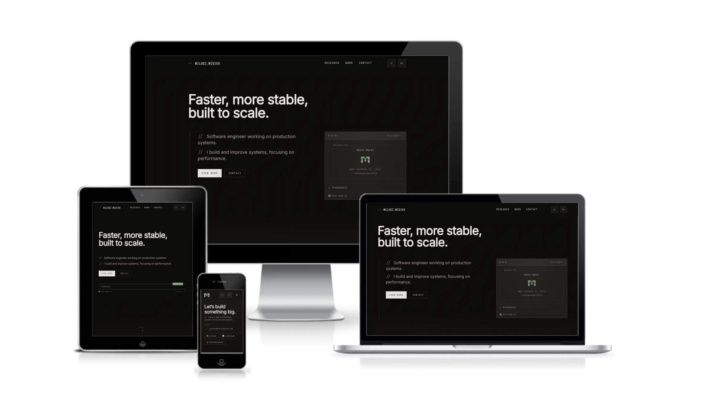

# Personal Portfolio

Personal portfolio and research hub. Built to present professional experience, academic publications, and featured products in a performant, multilingual, accessible site.

---

## Features

- **Bilingual (EN / PL)** — full content and UI localization via Astro's i18n routing; English served at `/`, Polish at `/pl/*`
- **Experience timeline** — animated, intersection-observer-driven work and academic history
- **Publications deck** — carousel of research papers with status badges, abstracts, and DOI links
- **Products showcase** — parallax image cards for featured projects with NDA support
- **Contact form** — Netlify Forms submission with honeypot spam guard, validation, and animated state transitions
- **Theme system** — dark/light toggle with anti-FOUC script, persisted to `localStorage`
- **Terminal widget** — typewriter hero animation with a mock CLI profile panel

---

## Tech Stack

| Layer | Choices |
|---|---|
| Framework | [Astro](https://astro.build) v5 (static, file-based routing) |
| UI | React v19 (client islands via `client:load`) |
| Styling | Tailwind CSS v3, CSS custom properties, Framer Motion |
| Fonts | Inter, JetBrains Mono, VT323 |
| Carousel | Embla Carousel |
| Mobile nav | `@hanzo/react-drawer` |
| Forms | Netlify Forms (no backend required) |
| Tooling | TypeScript (strict), Prettier + Astro plugin |

**Architectural notes:**
- React is used only where interactivity is needed; all other components are Astro (zero-JS by default).
- All data (experience, publications, products, UI strings) lives in per-locale JSON files under `src/i18n/` — no CMS dependency.
- Colors are defined as RGB channels in CSS custom properties, enabling Tailwind opacity modifiers without extra config.
- The contact form is stateful via React Context with a custom hook; submission state machine covers idle → loading → success / error.

---

## Project Structure

```
src/
├── pages/          # Astro routing — index.astro + pl/ for Polish routes
├── views/          # Top-level page compositions (IndexPage.astro)
├── sections/       # Full-page sections: Hero, Header, Experience, Publications, Products, Contact
├── components/     # Scoped React + Astro components
│   ├── contact/    # Form, validation, submission logic
│   ├── timeline/   # Animated experience timeline
│   ├── publications/ # Publication cards and carousel
│   └── products/   # Product cards with parallax
├── i18n/
│   ├── en/         # English content + translations (JSON)
│   └── pl/         # Polish content + translations (JSON)
├── data/           # TypeScript types and schemas
├── hooks/          # useIsMobile, useTypewriter
├── layouts/        # Layout.astro — <head>, theme script, global structure
├── scripts/        # Browser-only TS modules imported by Astro <script> blocks
└── styles/         # Global CSS, theme variables, animations
public/             # Static assets (images, icons, favicon)
```

---

## Prerequisites

- **Node.js** ≥ 18
- **npm** (or pnpm / yarn)

No environment variables are required for local development. The contact form integrates with Netlify Forms and only works when deployed to Netlify.

---

## Setup

```bash
# Clone
git clone https://github.com/miloszmisiek/website.git
cd website

# Install dependencies
npm install
```

---

## Local Development

```bash
npm run dev
```

Starts the Astro dev server with hot module replacement. The site is available at `http://localhost:4321` by default.

---

## Build & Preview

```bash
# Production build → /dist
npm run build

# Preview the built output locally
npm run preview
```

---

## Deployment

The site is designed for **Netlify**. Push to your connected branch — Netlify handles the build (`astro build`) and serves `/dist`. The contact form backend is provided by Netlify Forms automatically. No additional configuration is needed beyond the `data-netlify` attributes already present in the markup.

---

> built with care (and vim, btw)
